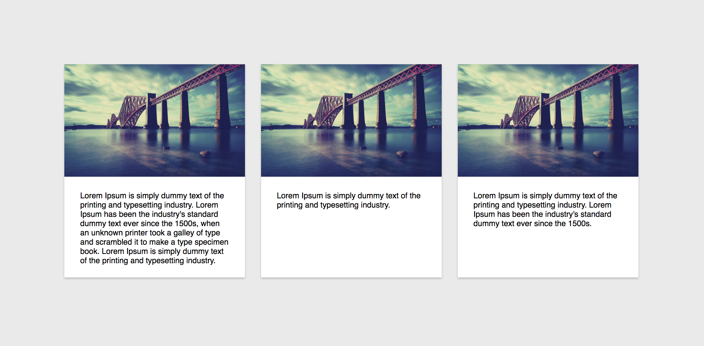

# heightify

A module for setting the same heights on given element.

[](https://travis-ci.org/oyvindhermansen/heightify)

## Install
```
$ git clone https://github.com/oyvindhermansen/heightify.git
$ npm install
```

## Usage
```javascript
import heightify from 'heightify'

/**
* Sets all divs to the same height as the tallest div on the page.
* Uses imagesLoaded because 'hasImages' is set to true.
* Will stop working when screen width is under 500px.
*/

heightify({
  element: document.querySelectorAll('div'),
  hasImages: true,
  destroyOnSize: 500
})

/**
* This also works great with jQuery selectors.
**/

```

## Options

The only required key for heightify is `element`.
The rest is optional.

* hasImages
* destroyOnSize

### Example on how it works with cards


### Development
`$ npm run dev`
This will run on both src/ and examples/

### Build:
For production:
`$ npm run build`

### Tests
* `$ npm test`
* `$ npm run test:watch`

### Contribute
If you want to contribute, just clone the repo and make a pull request or file an issue:)
